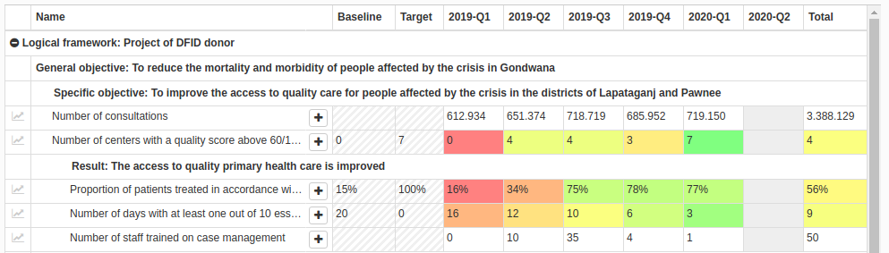

# Monitool



Monitool is an indicator monitoring application for humanitarian organisations built around 2014-2015, and regulary updated from user feedback since.

It is used to follow the indicators of most international programs as well as few domestic programs of Medecins du Monde France.

A demo version can be seen at http://monitool-training.medecinsdumonde.net (no account is required to login).


### Contributing

Documentation is available to help diving into the code

1. [Working on the frontend](./documentation/01-frontend.md)
2. [Working on the backend](./documentation/02-backend.md)


### Configuration

Monitool's API takes the following env variables:

```
MONITOOL_DEBUG                                      Enable/Disable stacktrack on API errors [default=false]
MONITOOL_BASE_URL                                   Used for redirecting user after 3rd party authentication [default=http://localhost:8000]

MONITOOL_PORT                                       Binded port for the API [default=8000]
MONITOOL_COOKIE_SECRET                              Secret to encrypt the cookies [no_default]
MONITOOL_COOKIE_SECRET_FILE                         Path to file containing the secret (allow using docker secrets)

MONITOOL_COUCHDB_HOST                               Self-explanatory [default=localhost]
MONITOOL_COUCHDB_PORT                               Self-explanatory [default=5984]
MONITOOL_COUCHDB_DATABUCKET                         Self-explanatory [default=monitool]
MONITOOL_COUCHDB_USER                               Self-explanatory [default=]
MONITOOL_COUCHDB_PASS                               Self-explanatory [default=]
MONITOOL_COUCHDB_PASS_FILE                          Path to file containing the secret (allow using docker secrets)

MONITOOL_AUTH_ADMINISTRATOR                         Login of account that will always be an admin, disregarding entry in database.

MONITOOL_AUTH_PROVIDERS_AZUREAD                     Boolean to enable Passport.js for AzureAD [default=false]
MONITOOL_AUTH_PROVIDERS_AZUREAD_LABEL               Label of button to log in with AzureAD on homepage [default="Use azure account"]
MONITOOL_AUTH_PROVIDERS_AZUREAD_DOMAIN              Which domain is allowed on AzureAD [default="hotmail.com"]
MONITOOL_AUTH_PROVIDERS_AZUREAD_TENANTID            Which tenant is allowed on AzureAD [default="common"]. Do not leave that in production!
MONITOOL_AUTH_PROVIDERS_AZUREAD_CLIENTID            ClientId of the OAuth2 app created in Azure for monitool
MONITOOL_AUTH_PROVIDERS_AZUREAD_CLIENTSECRET        ClientSecret of the same app
MONITOOL_AUTH_PROVIDERS_AZUREAD_CLIENTSECRET_FILE   Path to file to the client secret (allow usign docker secrets)

MONITOOL_AUTH_PROVIDERS_TRAINING                    Boolean to enable training mode (login as administrator w/o an account) [default=false]
MONITOOL_AUTH_PROVIDERS_TRAINING_LABEL              Label of button to log in [default="Use training account (admin)"]
MONITOOL_AUTH_PROVIDERS_TRAINING_ACCOUNT            Login of account used for training [default="training"]
```

### Install & Run

#### Development

To develop on Monitool, no need to install NodeJS or CouchDB.

To start a local instance, you can use either Docker Swarm or docker-compose:

```
# Clone the repo and go to the working directory
git clone git@github.com:medecins-du-monde/monitool.git
cd monitool

# Start with Docker Swarm
docker swarm init
docker stack deploy -c docker/compose-develop.yml monitool-dev
```

Both frontend and server source folders are binded from your filesystem: the frontend and backend code will autoreload when changes are made to the sources.

#### Production

To run monitool on a production server no need to compile on the host.
Prebuilt images are available on Docker Hub.

The compose files available on the repository are *for small deployment*.
All containers are kept in the same host, and a local docker volume is used for the database.

```
wget https://raw.githubusercontent.com/medecins-du-monde/monitool/master/docker/compose-production.yml
wget https://raw.githubusercontent.com/medecins-du-monde/monitool/master/docker/nginx.conf
wget https://raw.githubusercontent.com/medecins-du-monde/monitool/master/docker/redis.conf

printf "your-azuread-client-id" | docker secret create azuread_clientid -
printf "your-azuread-client-secret" | docker secret create azuread_clientsecret -
printf "a-long-random-string" | docker secret create monitool_cookiesecret -

docker stack deploy -c compose-production.yml monitool-prod
```


#### Starting CouchDB

When first starting CouchDB, it is required to configure the admin account.

This can be easily done by:
- Going to http://localhost:5984/_utils
- Configure as single node
- Configure admin account
- Update docker-compose file with the chosen credentials

Failing to do so will cause CouchDB to flood the logs with the following error:

```
[error] 2020-04-22T13:26:16.631859Z nonode@nohost <0.215.0> --------
Supervisor couch_secondary_services had child index_server started with
couch_index_server:start_link() at <0.217.0> exit with reason
{'EXIT',{{'EXIT',{database_does_not_exist,[{mem3_shards,load_shards_from_db,
"_replicator",[{file,"src/mem3_shards.erl"},{line,395}]},{mem3_shards,
load_shards_from_disk,1,[{file,"src/mem3_shards.erl"},{line,370}]},
{mem3_shards,for_db,2,[{file,"src/mem3_shards.erl"},{line,54}]},
{mem3_shards,local,1,[{file,"src/mem3_shards.erl"},{line,146}]},
{couch_index_server,handle_db_event,3,[{file,"src/couch_index_server.erl"},
{line,281}]},{couch_event_listener_mfa,handle_event,3,
[{file,"src/couch_event_..."},...]},...]}},...}} 
at couch_event_listener:do_event/3(line:150) in context child_terminated
```
